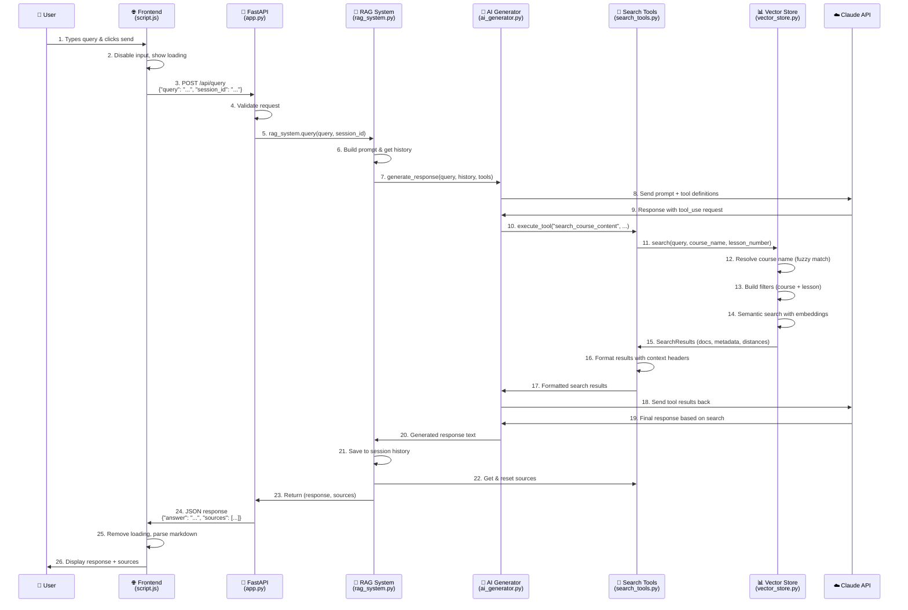
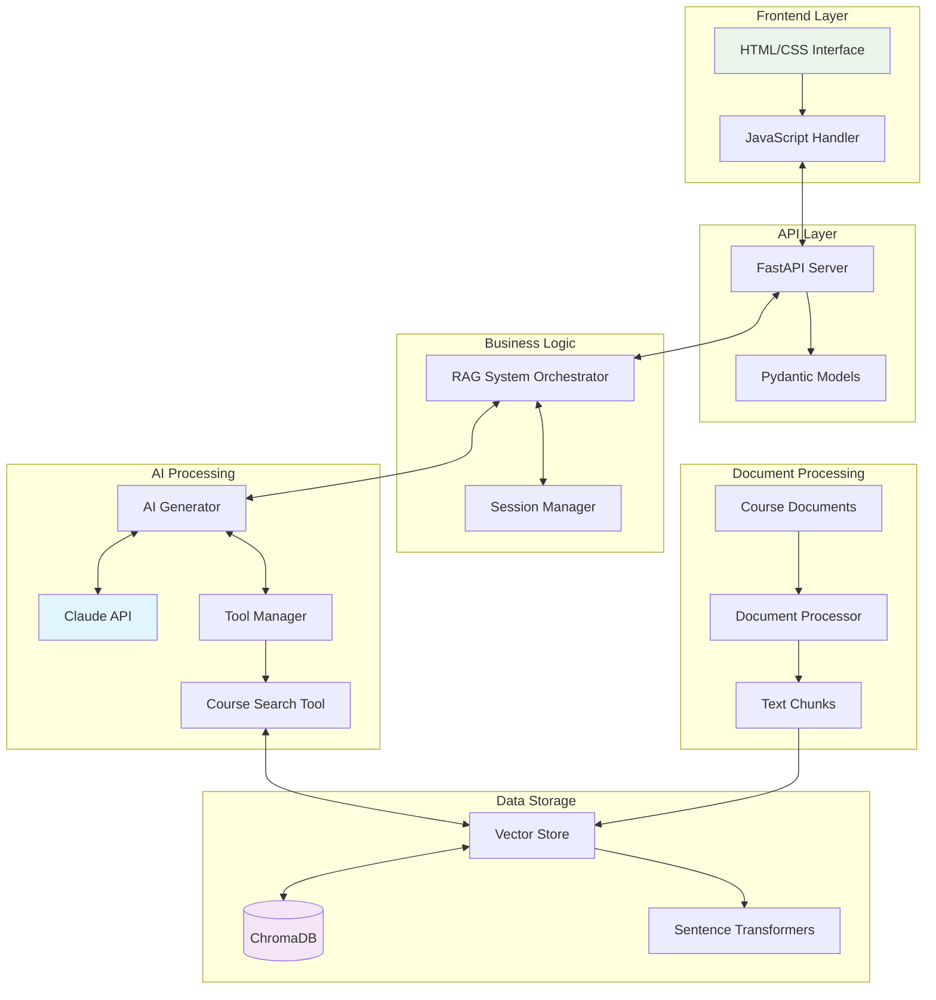
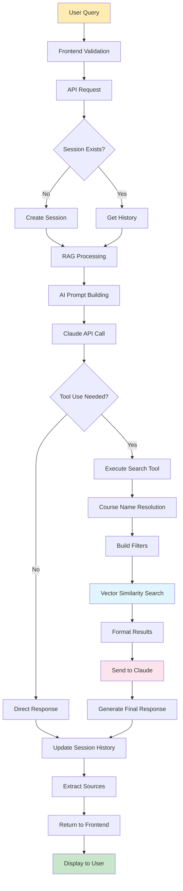

# RAG System Query Flow Diagram

```mermaid
sequenceDiagram
    participant User as 👤 User
    participant Frontend as 🌐 Frontend<br/>(script.js)
    participant API as 🔌 FastAPI<br/>(app.py)
    participant RAG as 🧠 RAG System<br/>(rag_system.py)
    participant AI as 🤖 AI Generator<br/>(ai_generator.py)
    participant Tools as 🔧 Search Tools<br/>(search_tools.py)
    participant Vector as 📊 Vector Store<br/>(vector_store.py)
    participant Claude as ☁️ Claude API

    User->>Frontend: 1. Types query & clicks send
    Frontend->>Frontend: 2. Disable input, show loading
    Frontend->>API: 3. POST /api/query<br/>{"query": "...", "session_id": "..."}
    
    API->>API: 4. Validate request
    API->>RAG: 5. rag_system.query(query, session_id)
    
    RAG->>RAG: 6. Build prompt & get history
    RAG->>AI: 7. generate_response(query, history, tools)
    
    AI->>Claude: 8. Send prompt + tool definitions
    Claude->>AI: 9. Response with tool_use request
    
    AI->>Tools: 10. execute_tool("search_course_content", ...)
    Tools->>Vector: 11. search(query, course_name, lesson_number)
    
    Vector->>Vector: 12. Resolve course name (fuzzy match)
    Vector->>Vector: 13. Build filters (course + lesson)
    Vector->>Vector: 14. Semantic search with embeddings
    Vector->>Tools: 15. SearchResults (docs, metadata, distances)
    
    Tools->>Tools: 16. Format results with context headers
    Tools->>AI: 17. Formatted search results
    
    AI->>Claude: 18. Send tool results back
    Claude->>AI: 19. Final response based on search
    AI->>RAG: 20. Generated response text
    
    RAG->>RAG: 21. Save to session history
    RAG->>Tools: 22. Get & reset sources
    RAG->>API: 23. Return (response, sources)
    
    API->>Frontend: 24. JSON response<br/>{"answer": "...", "sources": [...]}
    Frontend->>Frontend: 25. Remove loading, parse markdown
    Frontend->>User: 26. Display response + sources
```

## Data Flow Architecture

```mermaid
graph TB
    subgraph "Frontend Layer"
        UI[HTML/CSS Interface]
        JS[JavaScript Handler]
    end
    
    subgraph "API Layer"
        FastAPI[FastAPI Server]
        Models[Pydantic Models]
    end
    
    subgraph "Business Logic"
        RAG[RAG System Orchestrator]
        Session[Session Manager]
    end
    
    subgraph "AI Processing"
        AI[AI Generator]
        Claude[Claude API]
        Tools[Tool Manager]
        Search[Course Search Tool]
    end
    
    subgraph "Data Storage"
        Vector[Vector Store]
        Chroma[(ChromaDB)]
        Embeddings[Sentence Transformers]
    end
    
    subgraph "Document Processing"
        Docs[Course Documents]
        Processor[Document Processor]
        Chunks[Text Chunks]
    end
    
    UI --> JS
    JS <--> FastAPI
    FastAPI --> Models
    FastAPI <--> RAG
    RAG <--> Session
    RAG <--> AI
    AI <--> Claude
    AI <--> Tools
    Tools --> Search
    Search <--> Vector
    Vector <--> Chroma
    Vector --> Embeddings
    
    Docs --> Processor
    Processor --> Chunks
    Chunks --> Vector
    
    style Claude fill:#e1f5fe
    style Chroma fill:#f3e5f5
    style UI fill:#e8f5e8
```

## Component Interaction Flow

```mermaid
flowchart TD
    A[User Query] --> B[Frontend Validation]
    B --> C[API Request]
    C --> D{Session Exists?}
    D -->|No| E[Create Session]
    D -->|Yes| F[Get History]
    E --> G[RAG Processing]
    F --> G
    
    G --> H[AI Prompt Building]
    H --> I[Claude API Call]
    I --> J{Tool Use Needed?}
    
    J -->|No| K[Direct Response]
    J -->|Yes| L[Execute Search Tool]
    
    L --> M[Course Name Resolution]
    M --> N[Build Filters]
    N --> O[Vector Similarity Search]
    O --> P[Format Results]
    P --> Q[Send to Claude]
    Q --> R[Generate Final Response]
    
    K --> S[Update Session History]
    R --> S
    S --> T[Extract Sources]
    T --> U[Return to Frontend]
    U --> V[Display to User]
    
    style A fill:#ffecb3
    style V fill:#c8e6c9
    style O fill:#e1f5fe
    style Q fill:#fce4ec
```